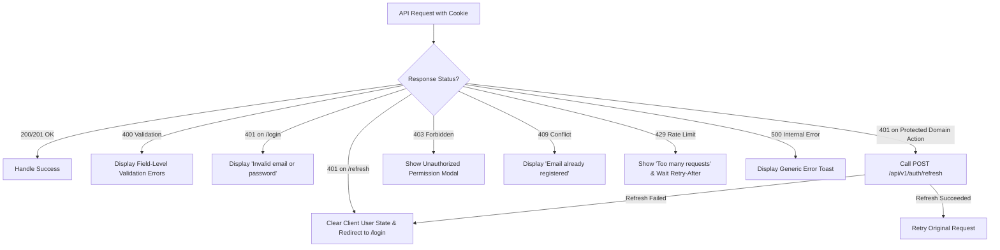

# Authentication Failure-Mode Matrix

**Document Status:** Approved & Canonical  
**Milestone:** Authentication & Authorization  
**Applicability:** `@aquaveda/server` (Express API) & Frontend Client Interceptors (`apps/web`)  
**Related Architecture Docs:**
- [`docs/architecture/decision-register.md`](./decision-register.md)
- [`docs/architecture/authentication-architecture-decision-report.md`](./authentication-architecture-decision-report.md)
- [`docs/architecture/authentication-implementation-plan.md`](./authentication-implementation-plan.md)

---

## 1. Executive Summary & Purpose

AquaVeda v2 adopts a proportionate security posture that defends against common web threats without accumulating speculative complexity. The authentication boundary consists of five minimal HTTP endpoints:
- `POST /api/v1/auth/register`
- `POST /api/v1/auth/login`
- `POST /api/v1/auth/logout`
- `GET /api/v1/auth/me`
- `POST /api/v1/auth/refresh`

All token transport relies exclusively on **HttpOnly cookies** (`access_token` on `/`, `refresh_token` on `/api/v1/auth`). Access tokens are short-lived, stateless JWTs containing only `{ sub }`. Refresh tokens are high-entropy JWTs containing `{ sub, sid }`, backed by a dedicated MongoDB `Session` document, and rotated atomically upon single use (`findOneAndDelete`).

This document provides the exhaustive, production-grade **Failure-Mode Matrix** across all failure scenarios:
1. Cryptographic token failures (tampering, expiration, secret separation).
2. Cookie transport breakdowns (missing, malformed, cross-site boundary).
3. Payload validation violations (missing fields, type mismatches, syntax errors).
4. Relational & lifecycle domain errors (conflicts, nonexistent accounts).
5. Cross-Origin Resource Sharing (CORS) rejections.
6. Rate limiting & denial-of-service mitigations.
7. Internal server errors and information disclosure protections.

---

## 2. Standardized Error Contract

All authentication error responses across the AquaVeda API conform to a uniform JSON error payload format:

```json
{
  "success": false,
  "code": "STRING_ERROR_CODE",
  "message": "Client-safe descriptive message"
}
```

### HTTP Status Code Mapping

| Status Code | Meaning | Usage in AquaVeda Authentication |
| :--- | :--- | :--- |
| **`400 Bad Request`** | Malformed syntax or request body validation failure | Zod schema validation failures (`VALIDATION_FAILED`), malformed JSON bodies. |
| **`401 Unauthorized`** | Authentication credentials missing, invalid, or expired | Wrong password/unknown email (`INVALID_CREDENTIALS`), unusable refresh token (`REFRESH_FAILED`), missing actor on protected operations (`UNAUTHORIZED`). |
| **`403 Forbidden`** | Authenticated actor lacks permission | Actor has authenticated identity but lacks necessary role or violates relational rules (e.g. self-review in moderation). |
| **`404 Not Found`** | Resource or route missing | Request to non-existent endpoint or missing entity target. |
| **`409 Conflict`** | Request conflicts with current server state | Email address already taken on registration (`EMAIL_ALREADY_REGISTERED`). |
| **`422 Unprocessable`** | Semantic validation errors | Reserved for multi-field semantic errors if differentiated from 400. In AquaVeda v2, request-shape errors map to 400 per Zod convention. |
| **`429 Too Many Requests`** | Rate limit quota exceeded | Excessive requests within sliding window (`RATE_LIMIT_EXCEEDED`). |
| **`500 Internal Error`** | Unhandled server exception | Database down, uncaught exception (`INTERNAL_ERROR`). Always sanitized. |

---

## 3. Comprehensive Failure-Mode Matrix

| ID | Endpoint | Trigger / Failure Scenario | HTTP Status | Error `code` | Error `message` | Cookies & Headers | Mitigation Strategy / Security Invariant |
| :--- | :--- | :--- | :--- | :--- | :--- | :--- | :--- |
| **VAL-01** | `POST /register` | Completely empty body (`{}` or null) | `400` | `VALIDATION_FAILED` | `"name is required"` | None | Zod validation rejects before touching service layer or database. |
| **VAL-02** | `POST /register` | Whitespace-only name (`name: "   "`) | `400` | `VALIDATION_FAILED` | `"name is required"` | None | Stripped via `.trim()`, checked via `.min(1)`. |
| **VAL-03** | `POST /register` | Name exceeds 100 characters | `400` | `VALIDATION_FAILED` | `"name must be at most 100 characters"` | None | Guard against memory exhaustion and buffer bloat. |
| **VAL-04** | `POST /register` | Malformed email string (`email: "invalid"`) | `400` | `VALIDATION_FAILED` | `"must be a valid email address"` | None | Standard RFC-compliant email regex validation. |
| **VAL-05** | `POST /register` | Password shorter than 8 chars (`password: "abc"`) | `400` | `VALIDATION_FAILED` | `"password must be at least 8 characters"` | None | Minimum entropy enforcement for new accounts. |
| **VAL-06** | `POST /register` | Password exceeds 128 chars | `400` | `VALIDATION_FAILED` | `"password must be at most 128 characters"` | None | Rejects pathological input to prevent DoS against `scrypt` hashing. |
| **VAL-07** | `POST /register` | Property type mismatch (`password: 12345`) | `400` | `VALIDATION_FAILED` | `"Expected string, received number"` | None | Zod type safety prevents internal driver errors. |
| **VAL-08** | `POST /login` | Missing email or password | `400` | `VALIDATION_FAILED` | Field-specific error | None | Rejects malformed shape before credential comparison. |
| **VAL-09** | `POST /login` | Empty password string (`password: ""`) | `400` | `VALIDATION_FAILED` | `"password is required"` | None | Rejects empty password without attempting scrypt verification. |
| **VAL-10** | Any `POST` | Malformed raw JSON syntax (`{"name": `) | `400` | N/A (Express syntax) | Syntax error message | None | Built-in `express.json()` middleware parsing guard. |
| **AUTH-01** | `POST /login` | Non-existent email address | `401` | `INVALID_CREDENTIALS` | `"Invalid email or password"` | None | **Anti-Enumeration Invariant:** Byte-for-byte identical error code and message as wrong password. |
| **AUTH-02** | `POST /login` | Wrong password for existing user | `401` | `INVALID_CREDENTIALS` | `"Invalid email or password"` | None | Uses `crypto.timingSafeEqual` over scrypt key to prevent timing side-channels. |
| **AUTH-03** | `POST /login` | Short password (< 8 chars) on login | `401` | `INVALID_CREDENTIALS` | `"Invalid email or password"` | None | **Anti-Leakage Invariant:** Login schema does NOT enforce 8-character min. Reaches credential check to avoid disclosing policy/existence. |
| **REG-01** | `POST /register` | Email already exists (fast-path check) | `409` | `EMAIL_ALREADY_REGISTERED` | `"An account with email \"...\" already exists"` | None | Fast `findOne` pre-check prevents unnecessary password hashing. |
| **REG-02** | `POST /register` | Concurrent race with identical email | `409` | `EMAIL_ALREADY_REGISTERED` | `"An account with email \"...\" already exists"` | None | Catches Mongo E11000 duplicate key error and translates to identical domain error. |
| **TOK-01** | `POST /refresh` | Missing `refresh_token` cookie header | `401` | `REFRESH_FAILED` | `"Refresh failed"` | `Set-Cookie` clears access & refresh cookies | Clears stale client cookies so browser stops resending broken sessions. |
| **TOK-02** | `POST /refresh` | Empty cookie string (`refresh_token=`) | `401` | `REFRESH_FAILED` | `"Refresh failed"` | `Set-Cookie` clears cookies | Treated identically to missing token. |
| **TOK-03** | `POST /refresh` | Tampered signature on refresh JWT | `401` | `REFRESH_FAILED` | `"Refresh failed"` | `Set-Cookie` clears cookies | `verifyRefreshToken` fails HMAC check with `JWT_REFRESH_SECRET`. |
| **TOK-04** | `POST /refresh` | Expired refresh JWT (`exp` in past) | `401` | `REFRESH_FAILED` | `"Refresh failed"` | `Set-Cookie` clears cookies | `jsonwebtoken` raises `TokenExpiredError`, mapped to generic failure. |
| **TOK-05** | `POST /refresh` | Session expired in DB (`expiresAt < now`) | `401` | `REFRESH_FAILED` | `"Refresh failed"` | `Set-Cookie` clears cookies | Independent query filter `{ expiresAt: { $gt: new Date() } }` rejects logically expired session before TTL sweep. |
| **TOK-06** | `POST /refresh` | Replay of consumed/rotated token | `401` | `REFRESH_FAILED` | `"Refresh failed"` | `Set-Cookie` clears cookies | **Single-Use Invariant:** Old session document was atomically deleted upon first rotation. |
| **TOK-07** | `POST /refresh` | Concurrent refresh with same token | `401` (for loser) | `REFRESH_FAILED` | `"Refresh failed"` | `Set-Cookie` clears cookies | Atomic `findOneAndDelete` guarantees exactly one winner; loser fails cleanly. |
| **TOK-08** | `POST /refresh` | Token Confusion: Access JWT sent as refresh | `401` | `REFRESH_FAILED` | `"Refresh failed"` | `Set-Cookie` clears cookies | Separate `JWT_REFRESH_SECRET` fails verification of token signed with `JWT_ACCESS_SECRET`. |
| **TOK-09** | `POST /refresh` | Underlying user deleted | `401` | `REFRESH_FAILED` | `"Refresh failed"` | `Set-Cookie` clears cookies | Session consumed, but `User.findById` yields null; rejects issuance. |
| **MID-01** | `GET /me` | Missing `access_token` cookie | `200` | N/A | N/A | Body: `{ success: true, user: null }` | **Product Invariant 5 (Anonymous Browsing):** Advisory middleware sets `req.actorContext = null`. |
| **MID-02** | `GET /me` | Expired `access_token` JWT | `200` | N/A | N/A | Body: `{ success: true, user: null }` | Does not abort request; sets `req.actorContext = null`. |
| **MID-03** | `GET /me` | Tampered `access_token` signature | `200` | N/A | N/A | Body: `{ success: true, user: null }` | HMAC mismatch caught; silently falls back to anonymous context. |
| **MID-04** | `GET /me` | Token Confusion: Refresh JWT sent as access | `200` | N/A | N/A | Body: `{ success: true, user: null }` | Fails verification against `JWT_ACCESS_SECRET`; falls back to anonymous. |
| **MID-05** | `GET /me` | Malformed `sub` (invalid ObjectId) | `200` | N/A | N/A | Body: `{ success: true, user: null }` | Mongoose CastError caught; gracefully resolves to `null`. |
| **MID-06** | `GET /me` | User deleted after token issuance | `200` | N/A | N/A | Body: `{ success: true, user: null }` | DB read finds no user document; resolves to `null`. Prevents zombie JWT usage. |
| **OUT-01** | `POST /logout` | Missing refresh cookie | `200` | N/A | N/A | `Set-Cookie` clears cookies | **Idempotent Contract:** Logout always succeeds and clears cookies. |
| **OUT-02** | `POST /logout` | Expired or tampered refresh cookie | `200` | N/A | N/A | `Set-Cookie` clears cookies | No session to delete; no error raised to client. |
| **CORS-01**| Any | Origin not in `ALLOWED_ORIGINS` | `200/204` | N/A | N/A | No `Access-Control-Allow-Origin` header | Express `cors` invokes `callback(null, false)`. Browser blocks response from being read. |
| **CORS-02**| Preflight `OPTIONS` | Disallowed origin preflight | `204/404` | N/A | N/A | No `Access-Control-Allow-*` headers | Browser refuses cross-origin POST/GET with credentials. |
| **RATE-01**| `POST /login`, `POST /register` | Rate limit quota exceeded (e.g. > 20/15m) | `429` | `RATE_LIMIT_EXCEEDED` | `"Too many requests, please try again later"` | `Retry-After: <seconds>` | Protects against credential stuffing and brute-force password guessing. |
| **ERR-01** | Any | Unhandled exception (e.g. DB connection dropped) | `500` | `INTERNAL_ERROR` | `"Internal server error"` | None | Unmapped exceptions sanitized; full stack trace logged to console only. |

---

## 4. Threat Models & Architectural Defenses

### 4.1 Account Enumeration & Information Leakage
- **Threat:** Attackers submit varied email addresses to `/login` to discover registered users based on differing error messages or response times.
- **Defense:**
  1. `login()` produces the exact same `INVALID_CREDENTIALS` error code and `"Invalid email or password"` message regardless of whether the email was missing or the password was incorrect.
  2. `loginSchema` intentionally omits registration password-length rules so malformed passwords still reach the credential comparator, eliminating shape-based account discovery.
  3. `verifyPassword()` uses constant-time comparison (`crypto.timingSafeEqual`) to protect against byte-by-byte timing attacks.

### 4.2 Cross-Secret Token Confusion Attacks
- **Threat:** An attacker uses a valid, unexpired Access Token in the `refresh_token` cookie, attempting to invoke session rotation or bypass session revocation.
- **Defense:**
  1. Separate cryptographic keys: `JWT_ACCESS_SECRET` vs. `JWT_REFRESH_SECRET`.
  2. A token signed with `JWT_ACCESS_SECRET` will fail signature verification against `JWT_REFRESH_SECRET` with an HMAC mismatch error.
  3. Separate payload contracts: Access token contains `{ sub }` only; Refresh token contains `{ sub, sid }`.

### 4.3 Refresh Token Replay & Race Conditions
- **Threat:** An attacker intercepts a valid Refresh Token and attempts to reuse it after the legitimate user has already refreshed, or multiple concurrent requests race to rotate the token.
- **Defense:**
  1. Single-use atomic consumption: `Session.findOneAndDelete({ _id: sid, userId: sub, tokenHash, expiresAt: { $gt: now } })`.
  2. In a concurrent race, MongoDB's document-level lock guarantees exactly one operation finds and deletes the document; subsequent requests observe `null` and throw `REFRESH_FAILED`.
  3. Stored hash validation: `tokenHash` stored in the database is a SHA-256 digest of the raw JWT, ensuring physical possession of the actual token string is required.

### 4.4 Cross-Site Cookie Transport Security (Topology B)
- **Threat:** Frontend (`localhost:3000` / `aquaveda.org`) and backend API (`localhost:5000` / `api.aquaveda.org`) reside on different domains, risking cookie drop or CSRF exploitation.
- **Defense:**
  1. `SameSite=None` is explicitly enforced.
  2. `Secure=true` is locked unconditionally (browsers discard `SameSite=None` cookies without `Secure`).
  3. `HttpOnly=true` is locked on all auth cookies, immunizing tokens against XSS theft.
  4. Path restriction: `refresh_token` is restricted to `path=/api/v1/auth`, preventing transmission on general API calls.
  5. CORS allowlist: Wildcard `*` with credentials is explicitly rejected.

---

## 5. Client Handling & Interceptor Guidelines

Frontend clients (e.g. Next.js application in `apps/web`) must follow standard interceptor behaviors based on these failure modes:



1. **401 on `POST /refresh`:** Represents total session termination. Client must wipe user state and redirect to login.
2. **401 on domain routes (e.g. creating an issue):** Triggers a single transparent attempt to invoke `/api/v1/auth/refresh`. If refresh succeeds, retry the original action; if refresh fails with 401, redirect to login.
3. **400 on `POST /register` or `/login`:** Client reads `message` to inform user which field failed validation.
4. **409 on `POST /register`:** Prompt the user that the account already exists and offer login or password reset.
5. **429 on any endpoint:** Inspect `Retry-After` header and disable submit button for the duration.
